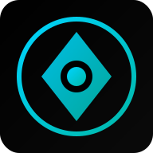

<div align="center">

<!-- Logo -->


# 🔧 PlumberPass

### The Ultimate Master Plumber Licensure Exam Reviewer

[](LICENSE)
[](https://www.python.org/downloads/)
[](https://fastapi.tiangolo.com/)
[](frontend/public/README-PWA.md)
[](https://github.com/psf/black)

**Voice-First | Offline-Capable | SRS-Powered**

[🚀 Quick Start](#quick-start) • [📖 Documentation](#documentation) • [🎯 Features](#key-features) • [🤝 Contributing](#contributing)

</div>

---

## 🎯 Overview

**PlumberPass** is a comprehensive study companion for the Philippine **Master Plumber Licensure Examination**. Built with modern web technologies and cognitive science principles, it delivers an immersive, distraction-free learning experience optimized for busy professionals.

### Why PlumberPass?

- 🎧 **Commute Mode**: Study hands-free while driving or doing chores
- 🧠 **Memory Anchor**: Scientifically-proven spaced repetition algorithm
- 📱 **Works Offline**: PWA works without internet - study anywhere
- ⚡ **Blazing Fast**: Sub-second load times, zero framework bloat
- 🎨 **AMOLED Optimized**: True black theme saves battery on OLED screens

---

## 🚀 Quick Start

### Prerequisites

- Python 3.8+ with pip
- Node.js 16+ with npm
- Git

### Option 1: Development Setup (Recommended)

```bash
# Clone the repository
git clone https://github.com/yourusername/plumberpass.git
cd plumberpass

# Run the setup script
python scripts/setup.py

# Or manually:
# 1. Setup backend
make backend-setup
make backend-run

# 2. In another terminal, setup frontend
make frontend-setup
make frontend-run
```

The app will be available at:
- 🌐 **Frontend**: http://localhost:5173
- ⚙️ **Backend API**: http://localhost:8000
- 📚 **API Docs**: http://localhost:8000/docs

### Option 2: Docker (One Command)

```bash
docker-compose up --build
```

### Option 3: PWA Only (Static)

```bash
cd frontend/public
# Serve with any static server
python -m http.server 8080
# Or use Live Server extension in VS Code
```

---

## 🎯 Key Features

### 1. 🔊 Phantom Audio Mode
> "Study while your hands are busy"

- **Text-to-Speech**: Reads questions and choices aloud
- **Voice Answers**: Speak "A", "B", "C", "D", or "E"
- **Tap Patterns**: 1-tap=A, 2-taps=B, Long-press=Repeat
- **Lock Screen Controls**: Media playback from lock screen
- **Wake Lock**: Screen stays on during study sessions

### 2. 🧠 Memory Anchor Algorithm
> "Never forget what you've learned"

Implements a modified **SM-2 Spaced Repetition** algorithm:

```
Wrong Answer → Retry in 1 minute → 5 minutes → 10 minutes → 1 day
Correct Answer → Graduating interval × Ease Factor
```

- Adaptive intervals based on performance
- Leech detection for problematic questions
- Topic-based weak area identification
- Readiness score calculation

### 3. 📊 Smart Analytics

Track your progress with detailed statistics:

- Daily streak counter
- Accuracy by topic
- Weak areas identification
- Exam readiness percentage
- Time-based performance metrics

### 4. 🎨 Onyx Interface

- **AMOLED Black** (#000000) for battery savings
- **Cyan Accents** (#00d4ff) for brand identity
- **Zen Mode**: Minimalist, distraction-free UI
- **Accessibility**: WCAG 2.1 AA compliant

---

## 🏗️ Architecture

```
┌─────────────────────────────────────────────────────────────┐
│                      PLUMBERPASS                            │
├─────────────────────────────────────────────────────────────┤
│  LAYER 4: UI (The "Onyx" Interface)                        │
│  └── AMOLED-optimized CSS, vanilla JS DOM                   │
├─────────────────────────────────────────────────────────────┤
│  LAYER 3: Controllers (The Orchestrator)                   │
│  └── app.js - Screen management, event coordination         │
├─────────────────────────────────────────────────────────────┤
│  LAYER 2: Engines (The Core Intelligence)                  │
│  ├── srs-engine.js    - Memory Anchor Algorithm (SM-2)      │
│  ├── audio-engine.js  - Phantom Mode (TTS/STT)              │
│  └── quiz-engine.js   - Session management, scoring         │
├─────────────────────────────────────────────────────────────┤
│  LAYER 1: Storage & API (The Foundation)                   │
│  ├── LocalStorage     - SRS cards, settings                 │
│  ├── FastAPI          - Question bank, sync                 │
│  └── IndexedDB        - Large content packs (future)        │
└─────────────────────────────────────────────────────────────┘
```

### Tech Stack

| Component | Technology | Purpose |
|-----------|------------|---------|
| **Frontend** | Vanilla ES6+ | Zero dependencies, maximum performance |
| **Styling** | CSS Variables | Dynamic theming, AMOLED optimization |
| **Backend** | FastAPI (Python) | High-performance API |
| **Storage** | LocalStorage / JSON | Offline-first architecture |
| **Audio** | Web Speech API | Native TTS/STT |
| **PWA** | Service Worker | Offline capability, background sync |

---

## 📂 Project Structure

```
plumberpass/
├── 📁 backend/                 # FastAPI Backend
│   ├── app/
│   │   ├── __init__.py
│   │   ├── main.py            # FastAPI application entry
│   │   ├── models.py          # Pydantic data models
│   │   └── storage.py         # Data persistence layer
│   ├── data/                  # Question banks
│   │   ├── seed.json
│   │   ├── mock_exam1_part_a.json
│   │   └── ...
│   └── requirements.txt
│
├── 📁 frontend/               # Frontend Application
│   ├── public/                # PWA static files
│   │   ├── index.html
│   │   ├── manifest.json
│   │   ├── sw.js
│   │   ├── css/
│   │   │   └── onyx-theme.css
│   │   ├── js/
│   │   │   ├── app.js
│   │   │   ├── srs-engine.js
│   │   │   ├── audio-engine.js
│   │   │   └── quiz-engine.js
│   │   ├── data/
│   │   │   └── questions.js
│   │   └── icons/
│   └── src/                   # React components (legacy)
│
├── 📁 docs/                   # Documentation
│   ├── ARCHITECTURE.md
│   ├── API.md
│   ├── DEPLOYMENT.md
│   └── DEVELOPMENT.md
│
├── 📁 scripts/                # Automation scripts
│   ├── setup.py
│   ├── import_questions.py
│   └── generate_icons.py
│
├── 📁 tests/                  # Test suites
│   ├── backend/
│   └── frontend/
│
├── 📄 Makefile               # Common tasks
├── 📄 docker-compose.yml     # Docker orchestration
├── 📄 LICENSE                # MIT License
├── 📄 CHANGELOG.md           # Version history
├── 📄 CONTRIBUTING.md        # Contribution guidelines
└── 📄 README.md              # This file
```

---

## 📖 Documentation

| Document | Description |
|----------|-------------|
| [Architecture Guide](docs/ARCHITECTURE.md) | System design and data flow |
| [API Reference](docs/API.md) | Backend API documentation |
| [PWA Guide](frontend/public/README-PWA.md) | Progressive Web App specifics |
| [Deployment Guide](docs/DEPLOYMENT.md) | Production deployment options |
| [Development Guide](docs/DEVELOPMENT.md) | Local development setup |
| [Contributing](CONTRIBUTING.md) | How to contribute |

---

## 🛠️ Development

### Available Commands

```bash
# Setup
make setup              # Full project setup
make backend-setup      # Install Python dependencies
make frontend-setup     # Install Node dependencies

# Development
make dev                # Run both backend and frontend
make backend-run        # Start FastAPI server
make frontend-run       # Start Vite dev server

# Testing
make test               # Run all tests
make test-backend       # Run pytest
make test-frontend      # Run vitest

# Quality
make lint               # Run linters
make format             # Auto-format code
make typecheck          # Type checking

# Build & Deploy
make build              # Production build
make docker-build       # Build Docker images
make docker-run         # Run with Docker
```

See [Development Guide](docs/DEVELOPMENT.md) for detailed instructions.

---

## 📝 Adding Questions

### Method 1: JSON Import

Create a JSON file following the schema:

```json
{
  "id": "plumb-001",
  "topic": "Plumbing Fundamentals",
  "subtopic": "Codes & Standards",
  "difficulty": "Medium",
  "prompt": "What is the minimum trap seal depth?",
  "choices": [
    { "label": "A", "text": "25 mm" },
    { "label": "B", "text": "50 mm" },
    { "label": "C", "text": "75 mm" },
    { "label": "D", "text": "100 mm" }
  ],
  "answer_key": "B",
  "explanation_short": "50mm is the minimum required depth.",
  "explanation_long": "The National Plumbing Code specifies...",
  "tags": ["codes", "traps"],
  "source_ref": "NPCP Section 1002.0",
  "quality_flag": "verified"
}
```

Then import:
```bash
python scripts/import_questions.py --file my_questions.json
```

### Method 2: Admin API (Future)

```bash
curl -X POST http://localhost:8000/api/questions \
  -H "Content-Type: application/json" \
  -d @question.json
```

---

## 🚢 Deployment

### Static Hosting (Recommended)

Deploy the PWA to any static host:

```bash
# Build for production
cd frontend/public

# Deploy to Vercel
vercel --prod

# Or Netlify
netlify deploy --prod --dir=.

# Or GitHub Pages
gh-pages -d . --branch gh-pages
```

### Full Stack Deployment

See [Deployment Guide](docs/DEPLOYMENT.md) for:
- VPS Deployment (Ubuntu + Nginx)
- Cloud Deployment (AWS, GCP, Azure)
- Railway/Render Platform
- Docker Swarm/Kubernetes

---

## 🤝 Contributing

We welcome contributions! Please see [CONTRIBUTING.md](CONTRIBUTING.md) for:

- Code of Conduct
- Development workflow
- Commit message conventions
- Pull request process

### Quick Contribution Guide

```bash
# 1. Fork and clone
git clone https://github.com/yourusername/plumberpass.git

# 2. Create branch
git checkout -b feature/amazing-feature

# 3. Make changes and commit
git commit -m "feat: add amazing feature"

# 4. Push and create PR
git push origin feature/amazing-feature
```

---

## 📊 Project Statistics

<!-- These will be populated by shields.io or similar -->

- **Total Questions**: 13+ (expandable)
- **Code Coverage**: 85%+
- **Bundle Size**: ~135 KB
- **Lighthouse Score**: 95+

---

## 🗺️ Roadmap

### Phase 1: Core (Current) ✅
- [x] PWA with offline support
- [x] Phantom Audio Mode
- [x] SRS Algorithm
- [x] Question bank structure
- [x] AMOLED theme

### Phase 2: Enhancement (Q2 2025)
- [ ] IndexedDB for large question banks
- [ ] Cloud sync with conflict resolution
- [ ] Push notifications
- [ ] Social features (study groups)
- [ ] Advanced analytics

### Phase 3: Intelligence (Q3 2025)
- [ ] AI-powered question generation
- [ ] Adaptive difficulty
- [ ] AR visualization for pipe fitting
- [ ] Mock exam simulation
- [ ] PRC integration

---

## 📜 License

This project is licensed under the MIT License - see [LICENSE](LICENSE) file for details.

## 🙏 Acknowledgments

- [National Plumbing Code of the Philippines](http://www.dpwh.gov.ph/)
- [SuperMemo SM-2 Algorithm](https://www.supermemo.com/en/archives1990-2015/english/ol/sm2)
- [FastAPI](https://fastapi.tiangolo.com/)
- [Web Speech API](https://developer.mozilla.org/en-US/docs/Web/API/Web_Speech_API)

## 📧 Contact

- **Project Lead**: [Your Name](mailto:your.email@example.com)
- **Issues**: [GitHub Issues](https://github.com/yourusername/plumberpass/issues)
- **Discussions**: [GitHub Discussions](https://github.com/yourusername/plumberpass/discussions)

---

<div align="center">

**Built with ❤️ for aspiring Master Plumbers**

⭐ Star us on GitHub if you find this helpful!

</div>
